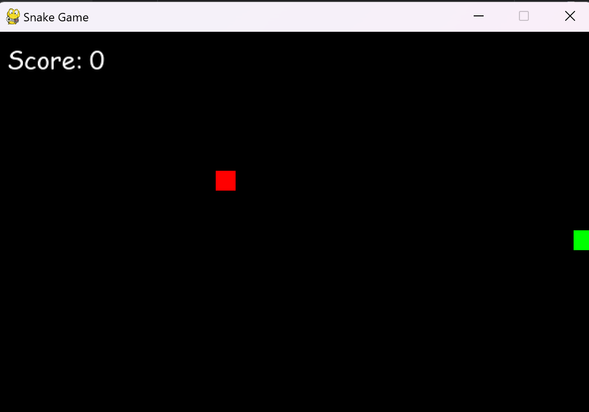

# 🐍 Snake Game

A classic snake game built using Python and Pygame.

---
## 📦 Setup

```bash
pip install -r requirements.txt
python main.py
```
---
## 🎮 Controls
- Arrow keys to move the snake.
- Eat apples to grow and score points.

---
## 📁 Structure
```
snake_game/
├── main.py
├── config.py
├── game/
│   ├── __init__.py
│   ├── snake.py
│   ├── apple.py
│   ├── game_engine.py
│   └── utils.py
├── assets/
│   ├── snake_head.png
│   ├── apple.png
│   └── eat_sound.wav
├── README.md
└── requirements.txt
```

---

## 🔊 Assets


---

# File: requirements.txt

pygame